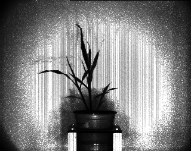

## Histogram Equalization

This is a method used to normalize the distribution of signal intensity values within an image. 
If the image has low contrast it will make it easier to threshold.

<<<<<<< HEAD
**HistEqualization**(*img, device, debug=None*)
=======
**HistEqualization**(*img, device, debug=False*)
>>>>>>> master

**returns** device, normalized image

- **Parameters:**
    - img - the original 2 dimensional grayscale image for analysis.
    - device - Counter for image processing steps
<<<<<<< HEAD
    - debug- None, "print", or "plot". Print = save to file, Plot = print to screen. Default = None
=======
    - debug- Default value is False, if True, filled intermediate image will be printed
>>>>>>> master
- **Context:**
    - Used to normalize the distribution of a signal intensity within an image.

**Grayscale image**





```python
import plantcv as pcv

# Examine signal distribution within an image
# prints out an image histogram of signal within image
<<<<<<< HEAD
device, he_img = pcv.HistEqualization(img, device, debug="print")
=======
device, he_img = pcv.HistEqualization(img, device, debug=True)
>>>>>>> master
```

**Normalized image**




