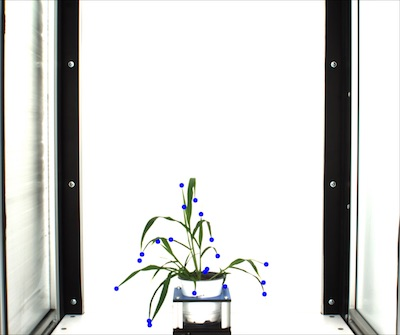

## Acute vertex

Perform a heuristic search for sharp angles given an object contour and user specified parameters. The acute (sharp)
angles are often associated with object tip points. Outputs a python list of points that meet criteria specified in parameters.

**acute_vertex**(*obj, window, thresh, img, device, debug=None*)

**returns** device, list of points that meet specified criteria 

- **Parameters:**
    - obj - A contour of the plant object (this should be output from the object_composition.py fxn)
    - window - The pre and post point distances on which to calculate angle of focal point (a value of 30 worked well for a sample image) on which to calculate the angle
    - thresh - Threshold to set for acuteness; keep points with an angle more acute than the threshold (a value of 15 worked well for sample image)
    - sep - The number of contour points to search within for the most acute value
    - img - A copy of the original image
    - device - Counter for image processing steps
    - debug- None, "print", or "plot". Print = save to file, Plot = print to screen. Default = None
- **Context:**
    - Used to identify tip points based upon the angle between focal pixel and reference points on contour. 
    
**Input plant contour**


```python
from plantcv import base as pcv

device = 1

# Identify acute vertices (tip points) of an object
# Results in set of point values that may indicate tip points
device, list_of_acute_points = pcv.acute_vertex(obj, 30, 15, 100, device, debug='print')
```

**Image of points selected**


