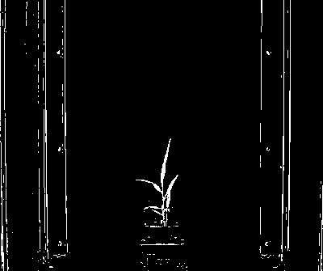
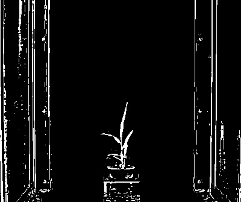

## Adaptive Threshold

Creates a binary image from a gray image using adaptive thresholding.

**plantcv.adaptive_threshold(*img, maxValue, thres_type, object_type*)**

**returns** thresholded image

- **Parameters:**
    - img - grayscale img object
    - maxValue - value to apply above threshold (255 = white)
    - thres_type  = type of thresholding ('gaussian' or 'mean')
    - objecttype - 'light' or 'dark', is target image light or dark?
- **Context:**
    - Used to help differentiate plant and background
    

**Grayscale image (green-magenta channel)**


```python
from plantcv import plantcv as pcv

# Set global debug behavior to None (default), "print" (to file), or "plot" (Jupyter Notebooks or X11)

pcv.params.debug = "print"

# Create binary image from a gray image based
threshold_gaussian = pcv.adaptive_threshold(img, 255, 'gaussian','dark')
```

**Auto-Thresholded image (gaussian)**



```python
from plantcv import plantcv as pcv

# Set global debug behavior to None (default), "print" (to file), or "plot" (Jupyter Notebooks or X11)

pcv.params.debug = "print"

# Create binary image from a gray image based 
threshold_mean = pcv.adaptive_threshold(img, 255, 'mean','dark')
```

**Auto-Thresholded image (mean)**


