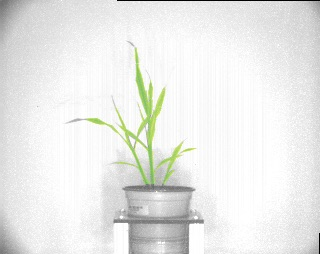

## Analyze NIR intensity

This function calculates the intensity of each pixel associated with the plant and writes 
the values out to a file. Can also print out a histogram plot of pixel intensity and a pseudocolor image of the plant.

**analyze_NIR_intensity**(*img, rgb, mask, bins, device, debug=False, filename=False*)

**returns** device, header of histogram, histogram values, histogram of proportion of signal/bin, pseudocolored image

- **Parameters:**
    - img - Input image
    - rgb - Input image with 3-dimensions (pseudocolor)
    - mask - Mask made from selected contours
    - bins - Number of class to divide spectrum into
    - device - Counter for image processing steps
    - debug - Default value is False, if True, filled intermediate image will be printed
    - filename - Name for output images
- **Context:**
    - Used to mask rectangluar regions of an image
- **Example use:**
    - [Use In Tutorial](nir_tutorial.md)

**Original grayscale image**


```python
import plantcv as pcv

# Caclulates the proportion of pixels that fall into a signal bin and writes the values to a file. Also provides a histogram of this data and a pseudocolored image of the plant.
device, hist_header, hist_data, h_norm  = pcv.analyze_NIR_intensity(img, rgb, mask, 256, device, debug=True, filename="pseudocolored_plant")
```

**Pseudocolored NIR signal**



**NIR signal histogram**


**Image with shape characteristics**


