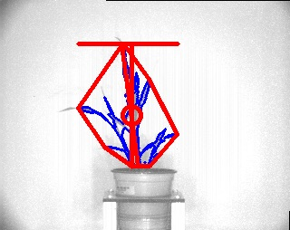

## Analyze NIR intensity

This function calculates the intensity of each pixel associated with the plant and writes 
the values out to a file. Can also print out a histogram plot of pixel intensity and a pseudocolor image of the plant.

**analyze_NIR_intensity**(*img, rgbimg, mask, bins, device, hisplot=False, debug=None, filename=False*)

**returns** device, header of histogram, histogram values, pseudocolored image

- **Parameters:**
    - img      - Input image
    - rgbimg   - Input image with 3-dimensions (for pseudocolor)
    - mask     - Mask made from selected contours
    - bins     - Number of class to divide spectrum into
    - device   - Counter for image processing steps
    - debug    - None, "print", or "plot". Print = save to file, Plot = print to screen. Default = None
    - filename - Name for output images
- **Context:**
    - Used to mask rectangluar regions of an image
- **Example use:**
    - [Use In NIR Tutorial](nir_tutorial.md)
    
**Output Data Units:** 
    - Bins - bin values based on number of bins set by user  
    - Signal Histogram - histogram of object pixel intensity values 0 (unsaturated) to 255 (saturated)     

**Original grayscale image**


```python
from plantcv import base as pcv

# Caclulates the proportion of pixels that fall into a signal bin and writes the values to a file. Also provides a histogram of this data and a pseudocolored image of the plant.
device, hist_header, hist_data, h_norm  = pcv.analyze_NIR_intensity(img, rgbimg, mask, 256, device, debug="print", filename="pseudocolored_plant")
```

**Pseudocolored NIR signal**


**NIR signal histogram**


**Image with shape characteristics**


