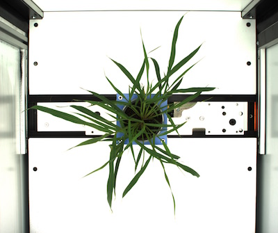
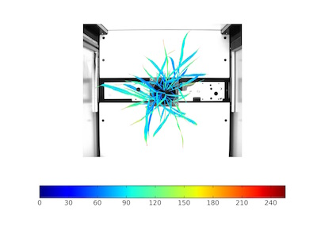

## Analyze Color

Extract color data of objects and produce pseudocolored images, can extract data for RGB (Red, Green, Blue), HSV (Hue, Saturation, Value) and LAB (Lightness, Green-Magenta, Blue Yellow) channels.

**plantcv.analyze_color**(*rgb_img, mask, bins, hist_plot_type=None, pseudo_channel='v', pseudo_bkg='img', filename=False*)

**returns** color channel histogram headers, color channel histogram data, analysis images  

- **Parameters:**  
    - rgb_img - RGB image data
    - mask - binary mask of selected contours
    - bins - number of color bins (0-256), if you would like to bin data, you would alter this number
    - hist_plot_type - None (default), 'all', 'rgb','lab' or 'hsv', this is the data to be printed to an SVG histogram file, however all (every channel) data is still stored to the database.
    - pseudo_channel - None, 'r'(red), 'g'(green), 'b'(blue), 'l' (lightness), 'm' (green-magenta), 'y' (blue-yellow), 'h'(hue),'s'(saturation), or default 'v'(value), creates pseduocolored image based on the specified channel.
    - pseudo_bkg = 'img' => channel image (default), 'white' => white background image, 'both' => both img and white options.
    - filename - False (default) or image name. If defined print image.
- **Context:**  
    - Used to extract color data from RGB, LAB, and HSV color channels.
    - Generates histogram of color channel data.
    - Generaes pseudocolored output image of one of the channels specified.
- **Example use:**  
 - [Use In VIS Tutorial](vis_tutorial.md)
 
- **Output Data Units:**  
    - Red Channel - histogram of object pixel intensity values 0 (unsaturated) to 255 (saturated)  
    - Green Channel - histogram of object pixel intensity values 0 (unsaturated) to 255 (saturated)  
    - Blue Channel - histogram of object pixel intensity values 0 (unsaturated) to 255 (saturated)  
    - Hue Channel - histogram of object pixel intensity values 0 (unsaturated) to 255 (saturated)  
    - Saturation Channel - histogram of object pixel intensity values 0 (unsaturated) to 255 (saturated)  
    - Value Channel - histogram of object pixel intensity values 0 (unsaturated) to 255 (saturated)  
    - Lightness Channel - histogram of object pixel intensity values 0 (unsaturated) to 255 (saturated)  
    - Green-Magenta Channel - histogram of object pixel intensity values 0 (unsaturated) to 255 (saturated)  
    - Blue-Yellow Channel - histogram of object pixel intensity values 0 (unsaturated) to 255 (saturated)  

**Original image**



```python

from plantcv import plantcv as pcv

# Set global debug behavior to None (default), "print" (to file), or "plot" (Jupyter Notebooks or X11)

pcv.params.debug = "print"

# Analyze Color
    
color_header, color_data, analysis_images = pcv.analyze_color(rgb_img, mask, 256, None, 'v', 'img', /home/user/analyze_color.png)
```

**Histograms of (R, G, B), (H, S, V), and (L, A, B) color channels**


**Pseudocolored value-channel image**


