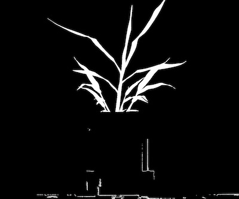
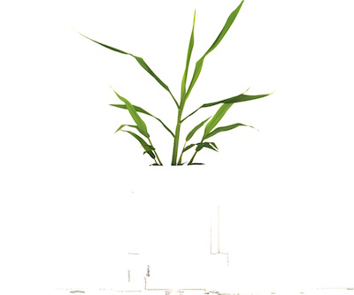
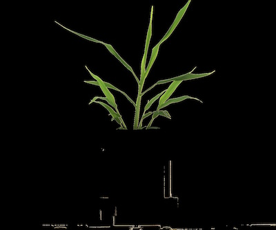

## Apply Mask

Apply binary mask to an image.

**apply_mask**(*img, mask, mask_color, device, debug=False*)

**returns** device, masked image

- **Parameters:**
    - img = image object to be masked
    - mask= binary image object (black background with white object)
    - mask_color= 'white' or 'black'
    - device- Counter for image processing steps
    - debug- Default value is False, if True, masked intermediate image will be printed 
- **Context:**
    - Apply a binary image mask over a grayscale or RGB image. Useful for seperating plant and background materials.
- **Example use:**
    - [Use In VIS Tutorial](vis_tutorial.md)
    - [Use In NIR Tutorial](nir_tutorial.md)
    - [Use In PSII Tutorial](psII_tutorial.md)

**Original RGB image**


**Mask image**



```python
import plantcv as pcv

# Apply binary 'white' mask over an image. 
device, masked_image = pcv.apply_mask(img, mask, 'white', device, debug=True)
```

**White-masked image**



```python
import plantcv as pcv

# Apply binary 'black' mask over an image.
device, masked_image = pcv.apply_mask(img, mask, 'black', device, debug=True)
```
  
**Black-masked image**


