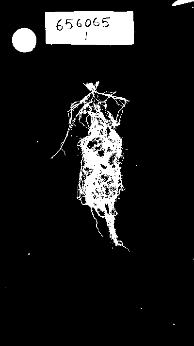

## Background Subtraction

Creates a binary image from a mixture of gaussian subtraction of the background from the foreground.
The binary image returned is a mask that should contain mostly foreground pixels and not background pixels.
The background image should be the same background as the foreground image except not containing the object
of interest.

Images must be of the same size and type.
If not, larger image will be taken and downsampled to smaller image size.
If they are of different types, an error will occur.

**background_subtraction(*foreground_image, background_image, device, debug=None*)**

**returns** device, foreground mask

- **Parameters**
    - foreground_image - grayscale or RGB image object
	- background_image - grayscale or RGB image object
	- device - Counter for image processing stops
	- debug - None, "print", or "plot". Print = save to file, Plot = print to screen. Default = None
- **Context:**
    - Used to extract object from foreground image containing it and background image without it.
	- E.g. A picture of a pot and the background and a picture of the plant, pot, and same background. Preferably taken from same background.
- **Example use:**
    - See below.

**Foreground Image**


**Background Image**


```python
import plantcv as pcv
# Create a foreground mask from both images using cv2.BackgroundSubtractorMOG().
device, fgmask = pcv.background_subtraction(foreground_image, background_image, device, debug = "print")
```

**Foreground Mask**


