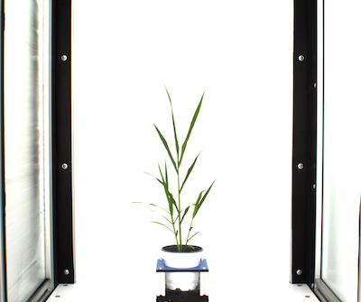
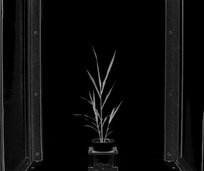
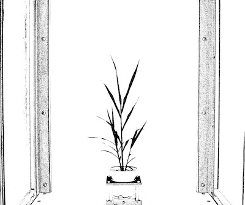

## Binary Threshold

Creates a binary image from a gray image based on the threshold values. 
The object target can be specified as dark or light.

**binary_threshold(*img, threshold, maxValue, object_type, device, debug=False*)**

**returns** device, thresholded image

- **Parameters:**
    - img - grayscale img object
    - threshold - threshold value (0-255)
    - maxValue - value to apply above threshold (255 = white)
    - objecttype - 'light' or 'dark', is target image light or dark?
    - device- Counter for image processing steps
    - debug- Default value is False, if True, thresholded intermediate image will be printed
- **Context:**
    - Used to help differentiate plant and background
- **Example use:**
    - [Use In VIS Tutorial](vis_tutorial.md)
    - [Use In NIR Tutorial](nir_tutorial.md)
    - [Use In PSII Tutorial](psII_tutorial.md)
    
**Original image**



**Grayscale image (saturation channel)**



```python
import plantcv as pcv

# Create binary image from a gray image based on threshold values. Targeting light objects in the image.
device, threshold_light = pcv.binary_threshold(img, 36, 255, 'light', device, debug=True)
```

**Thresholded image**


```python
import plantcv as pcv

# Create binary image from a gray image based on threshold values. Targeting dark objects in the image.
device, threshold_dark = pcv.binary_threshold(img, 36, 255, 'dark', device, debug=True)
```

**Thresholded image (inverse)**


