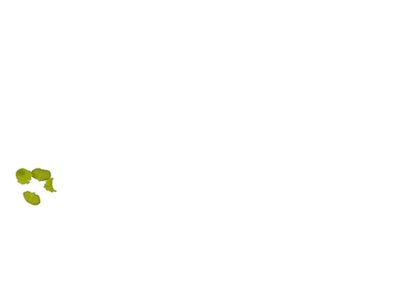

## Cluster Contours and Split Images

This function takes clustered contours and splits them into multiple images, also does a check to make sure that
the number of inputted filenames matches the number of clustered contours.

**plantcv.cluster_contour_splitimg**(*img, grouped_contour_indexes, contours, hierarchy, outdir, file=None, filenames=None*)

**returns** output_paths

- **Parameters:**
    - img = image object to be masked
    - grouped_contour_indexes = output of cluster_contours, indexes of clusters of contours
    - contours = contours to cluster, output of cluster_contours
    - hierarchy = object hierarchy
    - outdir = directory for output images
    - file = the name of the input image to use as a base name , output of filename from read_image function
    - filenames = input txt file with list of filenames in order from top to bottom left to right (likely list of genotypes)
- **Context:**
    - 
- **Example use:**
    - [Use In Multi-Plant Tutorial](multi-plant_tutorial.md)


**Output of Cluster Contours**


```python
from plantcv import plantcv as pcv

# Set global debug behavior to None (default), "print" (to file), or "plot" (Jupyter Notebooks or X11)

pcv.params.debug = "print"

# Cluster Contours and Split into Separate Images 
out = './examples/'
output_path = pcv.cluster_contour_splitimg(img1, clusters_i, contours, hierarchy, out, file, filenames=None)

```

**Split the Clusters into Separate Images (example of a few images)**





