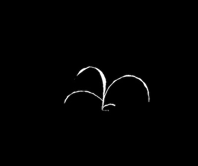
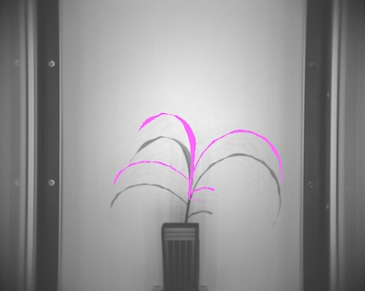
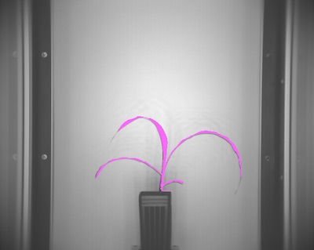

## Crop and position Mask

Takes a binary mask and positions it on another image. 

**crop_position_mask**(*img, mask, device,x,y,v_pos="top",h_pos="right", debug=None*)

**returns** device, newmask

- **Parameters:**
    - img - input image
    - mask - binary image to be used as a mask
    - device - Counter for image processing steps
    - x - amount to push in the vertical direction
    - y - amount to push in the horizontal direction
    - v_pos -push from the "top" or "bottom" in the vertical direction
    - h_pos - push from the "right" or "left" in the horizontal direction
    - debug - None, "print", or "plot". Print = save to file, Plot = print to screen. Default = None
- **Context:**
    - This function is used to position a binary mask over another image.
      The function will also resize the mask so it is the same size as the target image.
   
- **Example use:**
 - [Use in VIS/NIR Tutorial](vis_nir_tutorial.md)

**Original image**


**Original resized mask (using the resize function)**




```python
import plantcv as pcv

# Image not positioned (no adustment)

device, cropped1= pcv.crop_position_mask(img,mask,device,0,0,"top","right", debug="print")

```

****




```python
import plantcv as pcv

# Image positioned

device, cropped1= pcv.crop_position_mask(img,mask,device,40,3,"top","right", debug="print")

```

****


