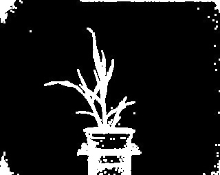

## Dilate

Perform morphological 'dilation' filtering. Adds pixel in center of the kernel if 
conditions set in kernel are true.

**dilate**(*img, kernel, i, device, debug=None*)

**returns** device, image after dilation

- **Parameters:**
    - img1 - Input image
    - kernel - An odd integer that is used to build a kernel x kernel matrix using np.ones
    - i - Iterations, i.e. the number of consecutive filtering passes
    - device - Counter for image processing steps
    - debug- None, "print", or "plot". Print = save to file, Plot = print to screen. Default = None
- **Context:**
    - Used to perform morphological dilation filtering. Helps expand objects at the edges, particularly after erosion.
- **Example use:**
    - [Use In NIR Tutorial](nir_tutorial.md)
    
**Input grayscale image**


```python
import plantcv as pcv

# Perform dilation
# Results in addition of pixels to the boundary of object
device, dilate_img = pcv.dilate(img, kernel, 1 device, debug='print')
```

**Image after dilation**


