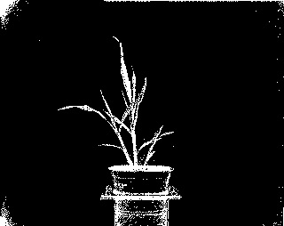

## Erode

Perform morphological 'erosion' filtering. Keeps pixel in center of the kernel if 
conditions set in kernel are true, otherwise removes pixel.

**plantcv.erode**(*img, kernel, i*)

**returns** image after erosion

- **Parameters:**
    - img1 - Input image
    - kernel - An odd integer that is used to build a kernel x kernel matrix using np.ones
    - i - Iterations, i.e. the number of consecutive filtering passes
   
- **Context:**
    - Used to perform morphological erosion filtering. Helps remove isolated noise pixels or remove boundary of objects.
- **Example use:**
    - [Use In NIR Tutorial](nir_tutorial.md)
    
**Input grayscale image**



```python
from plantcv import plantcv as pcv

# Set global debug behavior to None (default), "print" (to file), or "plot" (Jupyter Notebooks or X11)
pcv.params.debug = "print"

# Perform erosion filtering
# Results in removal of isolated pixels or boundary of object removal
er_img = pcv.erosion(img, kernel, 1)
```

**Image after erosion**


