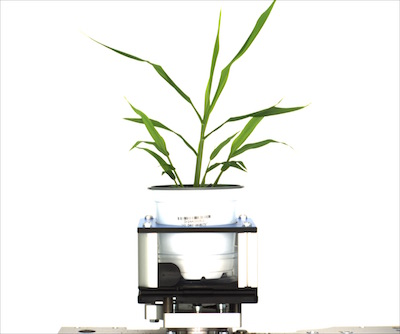
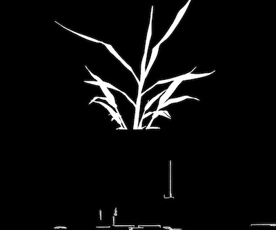
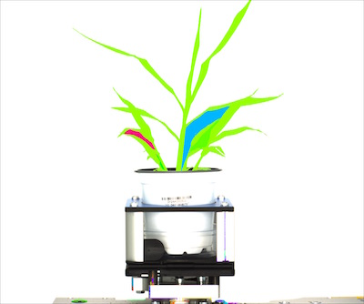

## Find Objects

Find objects within the image.

**plantcv.find_objects**(*img, mask*)

**returns** objects, object hierarchy

- **Parameters:**
    - img - image that the objects will be overlayed
    - mask - what is used for object detection
- **Context:**
    - Used to identify objects (plant material) in an image.
- **Example use:**
    - [Use In VIS Tutorial](vis_tutorial.md)
    - [Use In PSII Tutorial](psII_tutorial.md)


**Original image**



**Input binary mask**



```python
from plantcv import plantcv as pcv

# Set global debug behavior to None (default), "print" (to file), or "plot" (Jupyter Notebooks or X11)
pcv.params.debug = "print"

# Identify objects (plant material) in an image, all objects regardless of hierarchy are filled (e.g. holes between leaves).
id_objects, obj_hierarchy = pcv.find_objects(img, mask)
```

**Image with contours highlighted**


