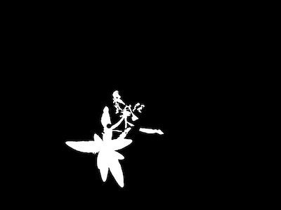
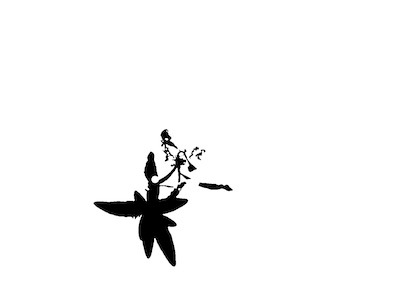

## Invert

Invert a binary image. This is a wrapper for the OpenCV function [bitwise_not](http://docs.opencv.org/2.4/modules/core/doc/operations_on_arrays.html#bitwise-not)

**invert**(*img, device, debug=None*)

**returns** device, inverted image

- **Parameters:**
    - img = image to be inverted (works best with binary image)
    - device- Counter for image processing steps
    - debug - None, "print", or "plot". Print = save to file, Plot = print to screen. Default = None
- **Context:**
    - Invert image values. Useful for inverting an image mask.
- **Example use:**
    - [Use In NIR Tutorial](nir_tutorial.md)
    - [Use In PSII Tutorial](psII_tutorial.md)
    
**Input binary image**



```python
import plantcv as pcv

# Invert a binary mask.
device, inverted_img = pcv.invert(img, device, debug="print")
```

**Inverted image**


