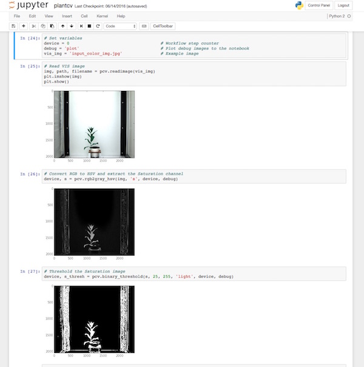

## Using PlantCV with Jupyter Notebooks

### About Jupyter

Jupyter Notebook is a web application that allows you to create
documents that contain code, outputs, and documentation. The code
in Jupyter Notebooks can be re-executed to refresh outputs after you
change a section of code. Jupyter Notebooks support many programming
languages. See [http://jupyter.org/](http://jupyter.org/).

### How to use PlantCV with Jupyter

In previous versions of PlantCV, debugging image analysis workflows
required running scripts with debug mode enabled so that intermediate
output images would be created for each step. In the latest versions
of PlantCV, analysis workflow scripts can be developed in Jupyter
Notebooks so that the input and output images of each step in a workflow
can be visualized instantly within the notebook.

**Example of PlantCV running in Jupyter**



PlantCV is automatically set up to run in Jupyter Notebook but there
are a couple of considerations.

First, if PlantCV is installed in the global Python search path, you can
import the PlantCV library like normal:

```python
import plantcv
```

On the other hand, if you installed PlantCV into a local Python path,
you will need to configure the Jupyter Python kernel to find it. For
example:

```python
import sys
sys.path.append("/home/user/plantcv")
import plantcv
```

Second, we use [matplotlib](http://matplotlib.org/) to do the
in-notebook plotting. To make this work, add the following to the top
of your notebook:

```python
%matplotlib inline
```

Third, PlantCV has a built-in debug mode that is set to `None` by 
default. Setting debug to `"print"` will cause PlantCV to print debug
images to files, which is the original debug method. In Jupyter, setting
debug to `"plot"` will cause PlantCV to plot debug images directly into
the notebook.

Bringing it all together, the first part of a notebook running PlantCV
would look like the following example:

```python
%matplotlib inline
import os
import sys
sys.path.append('/home/user/plantcv')
import numpy as np
import cv2
from matplotlib import pyplot as plt
import plantcv as pcv
from plantcv.dev.color_palette import color_palette

# Set variables
device = 0                                    # Workflow step counter
debug = 'plot'                                # Plot debug images to the notebook
img_file = 'input_color_img.jpg'              # Example image
```

Not all of these imports are required, this is just to demonstrate that
in addition to importing PlantCV you can import any other useful Python
packages as well.

Once a workflow has been developed, you currently need to export the
notebook as a Python script and modify it to function as a standalone
script that is compatible with the `plantcv-pipeline.py` program if your
goal is to parallelize your workflow on an image set. See [pipeline_parallel.md].
