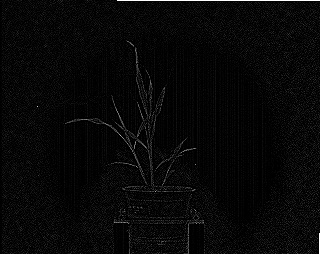

## Laplace Filter

This is a filtering method used to identify and highlight fine edges based on the 2nd derivative.

**laplace_filter**(*img, k, scale, device, debug=False*)

**returns** device, filtered image

- **Parameters:**
    - img - binary image object. This image will be returned after filling.
    - k - apertures size used to calculate 2nd derivative filter, specifies the size of the kernel (must be an odd integer: 1,3,5...)
    - scale - scaling factor applied (multiplied) to computed Laplacian values (scale = 1 is unscaled) 
    - device - Counter for image processing steps
    - debug- Default value is False, if True, filled intermediate image will be printed
- **Context:**
    - Used to define edges around objects

**Input grayscale image**


```python
import plantcv as pcv

# Apply to a grayscale image
# Filtered image will highlight areas of rapid pixel intensity change
device, lp_img = pcv.laplace_filter(img, 1, 1, device, debug=True)
```

**Image after Laplace filter**


