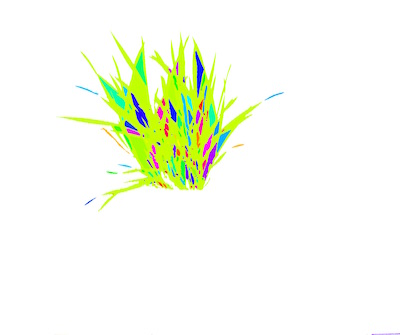

## Combine Objects

Combine objects together for downstream analysis, usually done after object filtering.

<<<<<<< HEAD
**object_composition**(*img, contours, hierarchy, device, debug=None*)
=======
**object_composition**(*img, contours, hierarchy, device, debug=False*)
>>>>>>> master

**returns** device, grouped object, image mask

- **Parameters:**
    - contours- object list
    - device- device number. Used to count steps in the pipeline
<<<<<<< HEAD
    - debug - None, "print", or "plot". Print = save to file, Plot = print to screen. Default = None
=======
    - debug- Default value is False, if True, intermediate image with ROI will be printed 
>>>>>>> master
- **Context:**
    - This function combines objects together. This is important for downstream analysis of shape characteristics, if plant objects are not combined then one plant can appear to be many different objects.
- **Example use:**
    - [Use In VIS Tutorial](vis_tutorial.md)
    - [Use In NIR Tutorial](nir_tutorial.md)
    - [Use In PSII Tutorial](psII_tutorial.md)


**Original image**


**Highlighted contours**



```python
import plantcv as pcv

# Combine objects so downstream analysis can be run on a single plant object
<<<<<<< HEAD
device, obj, mask = pcv.object_composition(img, roi_objects, hierarchy, device, debug="print")
=======
device, obj, mask = pcv.object_composition(img, roi_objects, hierarchy, device, debug=True)
>>>>>>> master
```

**Combined contours**


