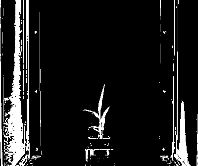

## Otsu Threshold

Creates a binary image from a gray image based on the threshold values. 

**plantcv.otsu_auto_threshold(*img, maxValue, object_type*)**

**returns** thresholded image

- **Parameters:**
    - img - grayscale img object
    - maxValue - value to apply above threshold (255 = white)
    - objecttype - 'light' or 'dark', is target image light or dark?
   
- **Context:**
    - Used to help differentiate plant and background

**Grayscale image (green-magenta channel)**


```python
from plantcv import plantcv as pcv

# Set global debug behavior to None (default), "print" (to file), or "plot" (Jupyter Notebooks or X11)
pcv.params.debug = "print"

# Create binary image from a gray image based on threshold values. Targeting light objects in the image.
threshold_light = pcv.otsu_auto_threshold(img, 255, 'dark')
```

**Thresholded image**


**Grayscale image (blue-yellow channel)**


```python
from plantcv import plantcv as pcv

# Set global debug behavior to None (default), "print" (to file), or "plot" (Jupyter Notebooks or X11)
pcv.params.debug = "print"

# Create binary image from a gray image based on threshold values. Targeting dark objects in the image.
threshold_dark = pcv.otsu_auto_threshold(img1, 255, 'light')
```

**Thresholded image (inverse)**


