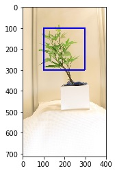
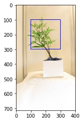

## class Params

A global PlantCV parameters class.

*class* plantcv.**Params**

`Params` is a class that stores global PlantCV attributes. An instance of `Params` is created on import automatically
as `plantcv.params`. Updated PlantCV functions import the `plantcv.params` instance to access globally
configured attributes.

### Attributes

Attributes are accessed as plantcv.*attribute*.

**device**: A counter for image processing steps that is autoincremented by functions that use `params`. Default = 0.

**debug**: Debugging mode. Values are `None`, "print", or "plot". Default = `None`.

**debug_outdir**: The directory to output debug images to when `plantcv.debug` = "print".

**line_thickness**: The line thickness for plots created by [pcv.analyze_object](analyze_shape.md), [pcv.analyze_bound_horizontal](analyze_bound_horizontal.md).
[pcv.analyze_bound_vertical](analyze_bound_vertical.md), [pcv.roi_objects](roi_objects.md), [pcv.object_composition](object_composition.md),
[pcv.scale_features](scale_features.md), [pcv.x_axis_pseudolandmarks](x_axis_pseudolandmarks.md), [y_axis_pseudolandmarks](y_axis_pseudolandmarks.md),
[pcv.acute_vertex](acute_vertex.md) and every region of interest function. Default = 5. 

### Example

Updated PlantCV functions use `params` implicitly, so overriding the `params` defaults will alter the behavior of
updated functions. In the meantime, it can also be used with older-style functions.

```python
from plantcv import plantcv as pcv

# Set debug to plot instead of None
pcv.params.debug = "plot"

# Use a pre-v3 function to open an image
# Note that pcv.params.debug is passed to the debug argument
img, imgpath, imgname = pcv.readimage(filename="test.png")

# Use a v3 function to create a region of interest
# Note that debug is not explicitly provided but is used implicitly by the function
roi_contour, roi_hierarchy = pcv.roi.rectangle(x=100, y=100, h=200, w=200, img=img)

# It might be preferred to have a thicker or thinner line drawn depending on the size of the image.
# Change line thickness from the default (5) to make it thinner, and plot the rectangular ROI again,  
# (note: this won't change the returns but instead is a purely optional preference regarding the plot in debug='print' and debug='plot') 
pcv.params.line_thickness = 3 
roi_contour, roi_hierarchy = pcv.roi.rectangle(x=100, y=100, h=200, w=200, img=img)

```
*Default Thickness (5)*



*pcv.params.line_thickness = 3*


