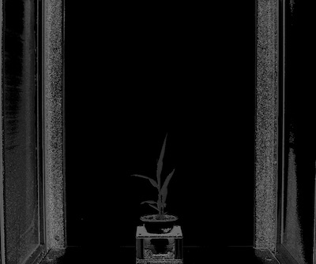
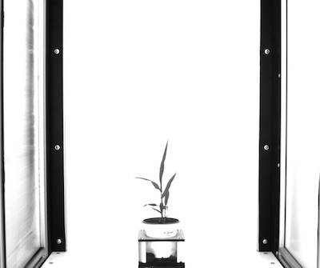

## RGB to HSV

Convert image from RGB colorspace to HSV colorspace and split the channels.

**rgb2gray_hsv**(*img, channel, device, debug=None*)

**returns** device, split image (h, s, or v channel)  

- **Parameters:**
    - img- Image to be converted
    - channel- Split 'h' (hue), 's' (saturation), or 'v' (value) channel
    - device- Counter for image processing steps
    - debug - None, "print", or "plot". Print = save to file, Plot = print to screen. Default = None
- **Context:**
    - Used to help differentiate plant and background
- **Example use:**
    - [Use In VIS Tutorial](vis_tutorial.md)
    - [Use In PSII Tutorial](psII_tutorial.md)

**Original RGB image**


```python
import plantcv as pcv

# image converted from RGB to HSV, channels are then split. Hue ('h') channel is outputed.

device, h_channel=pcv.rgb2gray_hsv(img, 'h', device, debug="print")
```

**Hue channel image**



```python
import plantcv as pcv
    
# image converted from RGB to HSV, channels are then split. Saturation ('s') channel is outputed.
    
device, s_channel= pcv.rgb2gray_hsv(img, 's', device, debug="print")
```  

**Saturation channel image**


```python
import plantcv as pcv

# image converted from RGB to HSV, channels are then split. Value ('v') channel is outputed.

device, v_channel=pcv.rgb2gray_hsv(img, 'v', device, debug="print")
```  

**Value channel image**


